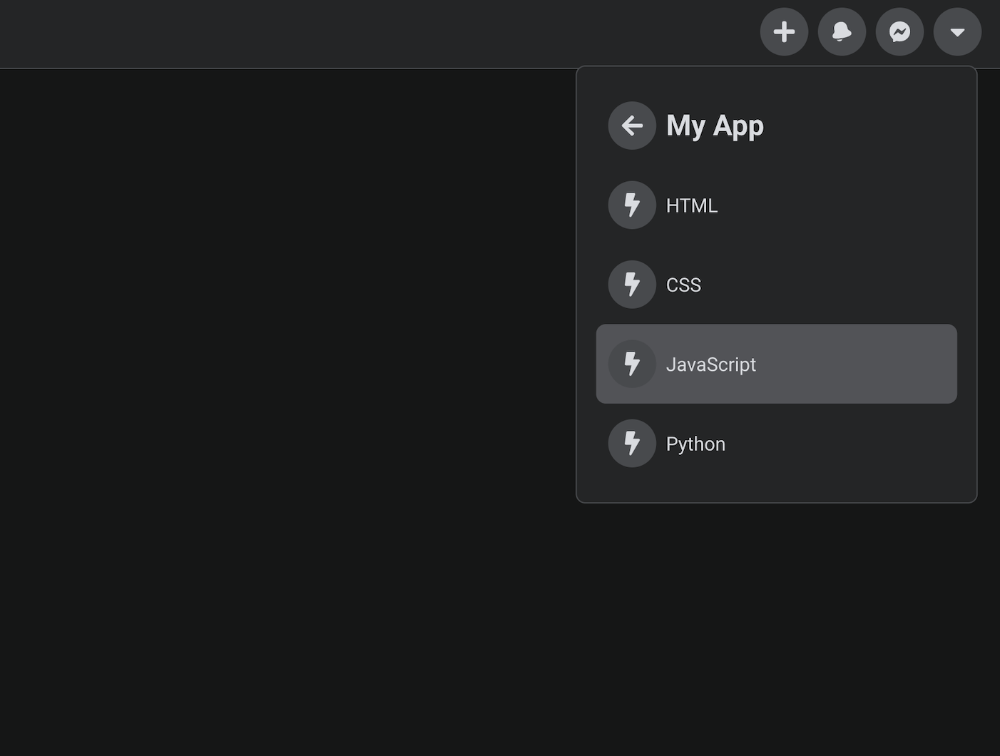

## Simple NavBar Component Built with React
I built this as a exercise in creating re-usable components that can be dropped in and reworked, replaced for different use cases. Also, I wanted to practice using CSS global variables and psuedo-selectors as well as transitions to create a *Facebook-esque* look, with a responsive dropdown menu.

### NPM packages Installed
`npm install react-transition-group`
